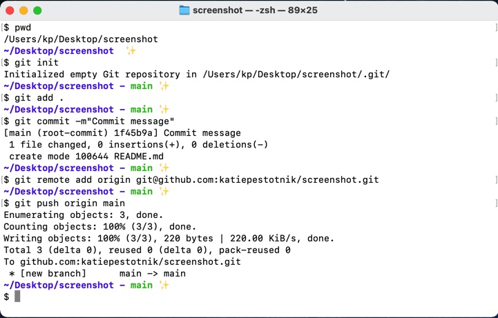

# BASH COMMANDS  CHEATSHEET

### BASICS

> cd : change directory 
>
>>- cd~ to home directory 
>>- cd .. to parent directory 
>
>ls: list directory contents 
>
>>- ls -a diplays all files including hidden 
>
>mkdir: create directory 
>
>touch: create file 
>
>mv: move && rename files and directories 
>
>rm: delete file 
>
>rm -r: delete directory and all files 
>
>clear: clears working window 

---
### GIT

### Git Steps
To be completed in **working** directory for your project

1. git init
2. git add .
3. git commit -m "Commit message"
4. git remote add origin (http or SSH key) 
5. git push origin main

---
##### Shell image of git steps

   

